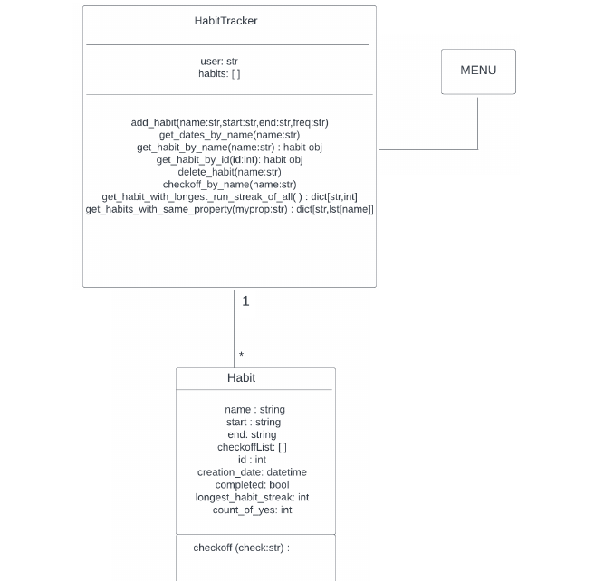
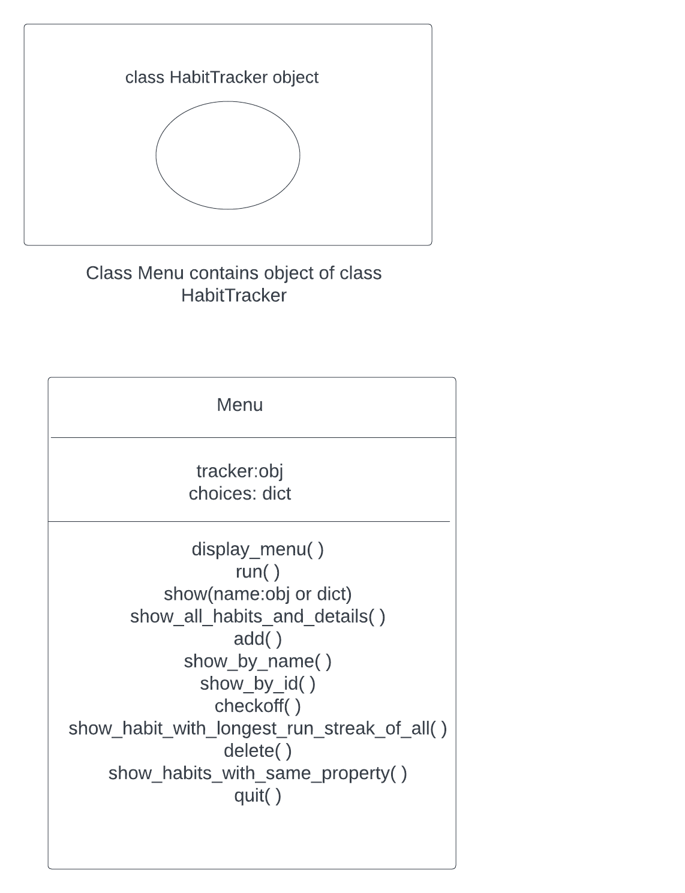

<!DOCTYPE html>
<html lang="en">
<head>
    <meta charset="UTF-8">
</head>
<body>
<h1>Overview</h1>
<hr>
<p>Habit tracking app that allows users to track their daily and weekly habits and 
      monitor their progress over time. </a></p>
<h2>Getting started</h2>

Before using the Habit Tracking App make sure you have Python3.6 installed on your computer.
<h3>How to run it?</h3>
     <ul>
      <li>Clone the repository from GitHub: git clone https://github.com/gianniprocida/habit_tracking_app.git</li>
      <li>Navigate to the habit-tracker directory: cd habit-tracking_app</li>
      <li>Install any dependencies required by the project:
        <ul>
          <li>pandas,matplotlib</li>
        </ul>
      </li>   
      <li>Run the project by executing the menu Python file: python menu.py</li>
      This should start the habit tracking program and allow you to interact with it via the user interface provided by the project.
    <ul>
  <h3>How to run unittests script</h3>
  <ul>
  <li> To execute tests for daily habits in the habit tracking app, run the script test_habitTrackingApp_D.py using the following command: python3.8 -m unittest test_habitTrackingApp_D.py. For weekly habits, use the script test_habitTrackingApp_W.py instead.</li>
<li> To execute tests for the function get_habit_by_id in the habit tracking app, run the script test_get_habit_by_id.py using the following command: python3.8 -m unittest test_get_habit_by_id.</li>
<h2>Features</h2>
<h3>Create new habits</h3>
To start tracking habits, you need to create a HabitTracker instance by providing the name of the user. Then we pass in the name of the habit,"Study OOP", the start date of the habit period,`2023-04-01`, the end date of the habit period,"2023-04-28", and the frequency,'D'.

```
tracker = HabitTracker("John")
tracker.add_habit("Study SQL","2023-04-01","2023-04-22","W")
tracker.add_habit("Study Python","2023-04-01","2023-04-22","W")
```

<h3>Delete a habit</h3>
We call the `delete_habit` method on the HabitTracking class and pass in the name of the habit we want to delete.
This will remove the habit with the name "Study Python" from the tracker object.

```
tracker.delete_habit("Study Python")
```

<h3>Get habit by name</h3>
We call the `get_habit_by_name` method on the HabitTracker class and pass in the 
name of the habit we want to retrieve. This will return a `Habit' instance with the specified name.

```
myhabit = tracker.get_habit_by_name("Study Python")
```

<h3>Get habit by id</h3>
We call the `get_habit_by_name` method on the HabitTracker class and pass in the id of
the habit we want to retrieve. This will return a `Habit' instance with the specified id.

```
myhabit = tracker.get_habit_by_id(1)
```
This will return the first habit that was added to our tracker.
<h3>Check off by name</h3>
We call the `checkoff_by_name` method on the HabitTracker class and pass in the name of the habit we want to check off. This 
will add the string "y" to the checkoffList of the `Habit` instance with the specified name.

```
tracker.checkoff_by_name("Study Python","y")
tracker.checkoff_by_name("Study SQL","y")
```
These are just a few examples of the functionality of this habit tracking app. 
For more information, please see the documentation or explore the source code or check the reflection phase.
<h2>Conception phase</h2>

In our habit tracking app, a Habit object can represent a task that needs to be performed 
regularly, such as studying a programming languages weekly or exercising daily. 
The <span style="color: red;">Habit</span> object can have attributes like name of the habit, 
start date, end date, frequency, checkofflist ( a list containing “y” or “n” to indicate 
whether the habit was completed or not for a day), ID, completed (whether the habit was 
completed within the given period), and longest habit streak (the maximum number of times 
the habit was completed in a row). To manage multiple habits in  the app, we can create a 
HabitTracker container object that 
has attributes like user name and a list of habits. This will make it easier to add new
 habits, delete habits, retrieve habits by name, retrieve habits by id or group habits by 
 specific attribues, and find the habit with the longest run streak. Moreover, 
 the Habit object includes a checkoff method that 
 allows users to mark the habit as completed (“y” or “n”) at any point in time. However, the total number of marks cannot 
 exceed the number of days in that period. If the maximum number of marks is reached, the 
 method will stop adding additional marks to the checkofflist attribute.
 The relationship between the two classes of objects in our tracking app can be described 
 using a UML class diagram. 
 This UML diagram provides a visual representation of the 
 one-to-many relationship between the Habit and HabitTracker classes, with one HabitTracker
  having zero or more Habit objects associated with it. 

 
 To interact with these objects, we can create a menu-based interface that allows users to carry out the aforementioned actions, including listing all the habits stored in the HabitTracker container object. The interface will provide users with a user-friendly approach to managing theirs habits and monitoring their advancement towards completing them.  It's also worth noting the type of relationship between the Menu class and the HabitTracker class. The Menu class and the HabitTracker class are in a "part-of" relationship because the HabitTracker class is a part of the Menu class object. While the HabitTracker class object has its own implementation, its object is created only after the Menu class object is created.





The interface simply needs to present a menu and allow the user to input choices. The menu class’s run method repeatedly displays a menu and respond to choices by calling functions on the HabitTracker. The choices entered by the user are strings. In the menu’s __init__ method, we create a dictionary that maps strings to functions on the menu object itself.  This allows us to retrieve the appropriate method to call based on the user’s choice.  The action variable actually refers to a specific method, and is called by appending empty brackets to the variable. Of course, the user might have entered an inappropriate choice, so we check if the action exists before calling it. Each of the various method request user input and call appropriate methods on the HabitTracker object associated with it. For example, for the get_habit_by_name method, after we find the habit with the specific name, we need to show it to the user, so we make the show function serve double duty; it receives a parameter and it determines its data type and performs a corresponding action. For example, if the parameter is a dictionary of string keys and integer values, the function will print the data as a dictionary. If the parameter is not a dictionary, the function assumes it is an object and prints all of its attributes. This distinction is important because the get_habit_by_name and get_habit_by_id methods both return an object, whereas the get_longest_run_streak_of_all and get_habits_with_same_property methods return dictionaries. For more information, please see the documentation or explore the source code.


 The folder structure for this project looks like this:
 <ul>
  <li>parent directory/
    <ul>
      <li>menu.py</li>
      <li>habit_tracking_app.py</li>
    </ul>
  </li>
</ul>
The Habit and HabitTracker objects can live together in one module. 
</body>
