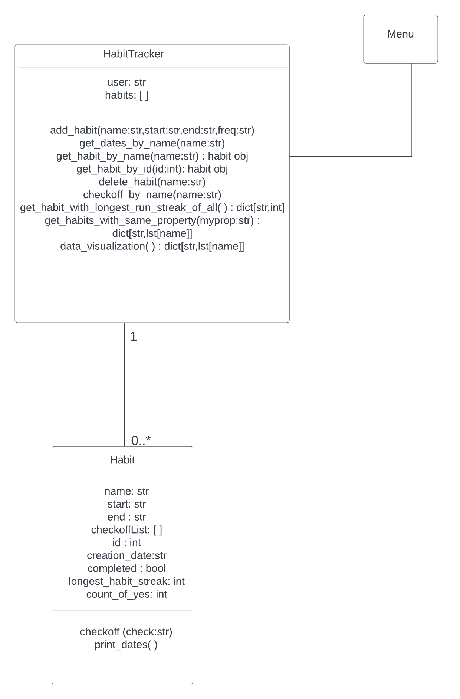

# Habit Tracking app
## Overview 
The HabitTracker is a tool that helps you stay organized by keeping track of your daily habit you want to do regularly, like exercising or reading, by storing them in a list.
## Run the app locally


To set up and run the application locally, follow these steps:

1. Install Virtual Environment.

Virtualenv is a tool used to set up isolated Python environments. To install it, run the following command:

```
pip install virtualenv.
```

2. Create a virtual environment using the venv module. Replace myvenv with your preferred name for the environment:

```
python3 -m venv myvenv
```

This command creates a new folder named myvenv, which contains the isolated environment.

3. Activate the Virtual Environment.

Activate the virtual environment using the appropriate command for your operating system:

On macOS/Linux:
```
source myvenv/bin/activate 
```

After activation, you'll notice (myvenv) in your terminal prompt, indicating that the virtual environment is active.
 

4. Check Installed Packages.

While the virtual environment is activated, you can check the list of installed packages using:

```
pip list
```
5. Install Required Python Packages.

```
pip install matplotlib
pip install pandas
```
5. Upgrade Pip (if necessary).

This ensures that you have the latest version of pip installed in your virtual environment.

6. Run the Application and the Unit Test.

With the virtual environment activated and necessary packages installed, you can now run your application and unit testlocally.

```
python3 habit_tracking_app.py
python3 -m unittest test_habitTrackingApp_D.py
```

7. Deactivate the Virtual Environment

Once you're done working with the application, you can deactivate the virtual environment using the command:

```
deactivate
```
This returns you to the global Python environment.


These are just a few examples of the functionality of this habit tracking app. 
For more information, please see the documentation or explore the source code or check the reflection phase.
## Conception phase


In our habit tracking app, a Habit object can represent a task that needs to be performed 
regularly, such as studying a programming languages weekly or exercising daily. 
The `Habit` object is equipped with several attributes:

* `habit`: The name of the habit
* `start`: The date when the habit starts.
* `end`: The date when the habit ends
* `freq`: How often the habit needs to be performed (e.g., daily, weekly).
* `checkoffList`:  A list containing “y” or “n” to indicate 
whether the habit was completed or not for a day.
* `longest_habit_streak`: The maximum number of times 
the habit was completed in a row.
* `completed`: Indicates if the habit was completed within the given period.
* `days_until_start`:  The number of days until the habit starts.
* `count_of_yes (int)`: The number of 'y' in the checkoffList.
<br/><br/> 
To manage multiple habits in  the app, we introduced a `HabitTracker` container object. This object serves as a central hub for organizing and manipulating habits seamlessly. Let's dive into its key components:

* `User`: Identifies the user associated with the habits
* `head`: Points to the first habit in the container object
* `tail`: Points to the last habit in the container object.
* `next`: Pointer pointing to the next habit

The HabitTracker operates as a linked list, with each habit object serving as a node. This structure enables efficient management of habits and supports various operations:

* `Adding new habits`: Users can easily add new habits to the tracker.
* `Deleting existing habits`: Unwanted habits can be removed from the tracker.
* `Retrieving habits`: Users can retrieve habits by name or by ID.
* `Grouping habit`: Habits can be grouped based on specific attributes.
<br/><br/> 
However, users won't be able to add habits directly using the `prepend` and `append` methods, as the tracker needs to ensure that habits with earlier starting dates are placed at the beginning of the linked list, while habits with later starting dates are placed at the end. Allowing users to use prepend and append methods could disrupt this chronological order.
Instead, the `add_habits` and `insert_habits` methods are to be used preserve the chronological order. These methods ensure that habits are inserted into the tracker in the correct order based on their starting dates.  The determination of the order is facilitated by the `days_until_start` attribute, which assesses whether a habit starts sooner or later. The relationship between the two classes of objects in our tracking app can be described  using a UML class diagram. This UML diagram provides a visual representation of the  one-to-many relationship between the Habit and HabitTracker classes, with one HabitTracker having zero or more Habit objects associated with it. 

 
To interact with these objects, we can create a menu-based interface that allows users to carry out the aforementioned actions, including listing all the habits stored in the HabitTracker container object. The interface will provide users with a user-friendly approach to managing theirs habits and monitoring their advancement towards completing them.  It's also worth noting the type of relationship between the Menu class and the HabitTracker class. The Menu class and the HabitTracker class are in a "part-of" relationship because the HabitTracker class is a part of the Menu class object. While the HabitTracker class object has its own implementation, its object is created only after the Menu class object is created.


The interface simply needs to present a menu and allow the user to input choices. The menu class’s run method repeatedly displays a menu and respond to choices by calling functions on the HabitTracker. The choices entered by the user are strings. In the menu’s __init__ method, we create a dictionary that maps strings to functions on the menu object itself.  This allows us to retrieve the appropriate method to call based on the user’s choice.  The action variable actually refers to a specific method, and is called by appending empty brackets to the variable. Of course, the user might have entered an inappropriate choice, so we check if the action exists before calling it. Each of the various method request user input and call appropriate methods on the HabitTracker object associated with it. For example, for the get_habit_by_name method, after we find the habit with the specific name, we need to show it to the user, so we make the show function serve double duty; it receives a parameter and it determines its data type and performs a corresponding action. For example, if the parameter is a dictionary of string keys and integer values, the function will print the data as a dictionary. If the parameter is not a dictionary, the function assumes it is an object and prints all of its attributes. This distinction is important because the get_habit_by_name and get_habit_by_id methods both return an object, whereas the get_longest_run_streak_of_all and get_habits_with_same_property methods return dictionaries. For more information, please see the documentation or explore the source code.


 The folder structure for this project looks like this:
 <ul>
  <li>parent directory/
    <ul>
      <li>menu.py</li>
      <li>habit_tracking_app.py</li>
    </ul>
  </li>
</ul>
The Habit and HabitTracker objects can live together in one module. 
</body>
